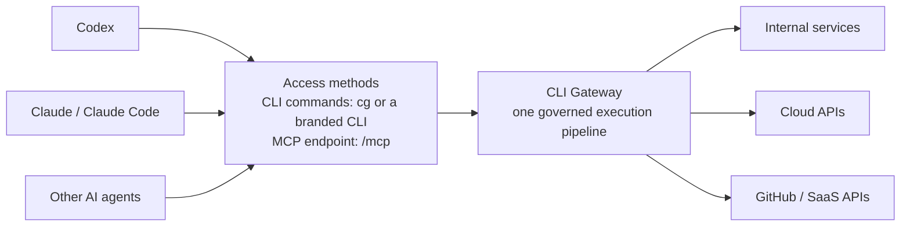

# CLI Gateway

[简体中文](README.zh-CN.md) | English

[](https://github.com/wyh0626/cli-gateway/actions/workflows/ci.yml)
[](https://github.com/wyh0626/cli-gateway/actions/workflows/codeql.yml)
[](https://pkg.go.dev/github.com/wyh0626/cli-gateway)
[](LICENSE)

CLI Gateway is a Go gateway that turns declarative HTTP API mappings into an
authenticated CLI command catalog and MCP Streamable HTTP tools. Both
transports use the same identity, policy, argument validation, downstream
credential, rate-limit, tracing, and audit pipeline.

> **Status:** pre-1.0. The core security and execution paths are tested, but
> configuration compatibility is not guaranteed until the first stable release.

## What it provides

- One governed API entry point for humans, CI jobs, and AI agents.
- Dynamic CLI commands without writing a separate client for every service.
- MCP tools generated from the same server-side manifest, with MCP
  `2026-07-28` stateless requests and legacy stateful clients on one endpoint.
- OIDC Authorization Code + PKCE and Device Authorization for the CLI.
- Explicit downstream authentication per API:
  `signed-identity`, RFC 8693 `token-exchange`, `client-credentials`,
  per-user `authorization-code`, and reviewed `bearer-passthrough`.
- Command allowlists, risk levels, confirmations, limits, circuit breakers,
  structured errors, metrics, and audit sinks.
- Build-time white-label clients with isolated environment variables, local
  storage, keyring entries, User-Agent, and manifest validation.

Codex, Claude, Claude Code, and other agents can either run the generated CLI
commands or connect directly to `/mcp`. Both paths reach the same governed
gateway pipeline and backend services.



## Choose a quick start

| Goal | Time | Guide |
|---|---:|---|
| Run everything locally with no account | 5 min | [Bundled demo](docs/getting-started.md) |
| Test a real, fully local OIDC provider | 10 min | [Keycloak](docs/tutorials/keycloak.md) |
| Use a hosted free-plan OIDC provider | 15 min | [Auth0 Device Flow](docs/tutorials/auth0.md) |
| Proxy GitHub with each user's identity | 20 min | [GitHub App](docs/tutorials/github.md) |

## Five-minute demo

Requirements: Docker with Compose, `curl`, and `jq`.

```bash
docker compose up --build -d

TOKEN="$(curl -fsS http://127.0.0.1:18080/token | jq -r .access_token)"
curl -fsS http://127.0.0.1:18082/readyz
curl -fsS -H "Authorization: Bearer $TOKEN" \
  http://127.0.0.1:18082/manifest | jq
curl -fsS -X POST \
  -H "Authorization: Bearer $TOKEN" \
  -H "Content-Type: application/json" \
  -d '{"args":{"delay-ms":5}}' \
  http://127.0.0.1:18082/exec/demo/work | jq

docker compose down
```

The bundled issuer and API are development fixtures. Never use them as
production identity or business services.

## Build

Requirements: Go 1.25.12 or newer.

```bash
make verify
make build

sudo install -m 0755 bin/cli-gateway bin/cg /usr/local/bin/
cli-gateway -manifest manifest.example.yaml
cg --help
```

Build only one component:

```bash
make build-gateway
make build-client
```

After the first public release, install the latest checksum-verified client
with:

```bash
curl --proto '=https' --tlsv1.2 -fsSL \
  https://raw.githubusercontent.com/wyh0626/cli-gateway/main/scripts/install.sh | sh
```

Pin a release with `CG_VERSION=v0.3.0`. Review downloaded scripts before
executing them in a production environment.

## Try the CLI OAuth flow

Start the local issuer, demo API, and gateway in separate terminals:

```bash
go run ./cmd/devissuer
go run ./cmd/demoapi
go run ./cmd/cli-gateway -manifest examples/e2e/manifest.yaml
```

Then authenticate and invoke the generated command:

```bash
export CG_SERVER=http://127.0.0.1:18082
cg login --device
# Open the printed URL and approve the device code.
cg capabilities -o json
cg demo work --delay-ms 5 -o json
cg whoami
```

Omit `--device` to use Authorization Code + PKCE with a random loopback
callback port. The CLI requests identity scopes only; command permissions do
not need to appear on the OAuth consent page. Each backend remains responsible
for business authorization.

`cg capabilities` returns the complete command and argument schema visible to
the current identity. Terminal agents can discover capabilities instead of
depending on a duplicated, stale command list:

```bash
CG_INVOKER=ai cg capabilities -o json
CG_INVOKER=ai cg demo stats -o json
```

## Add an API command

Start from [manifest.example.yaml](manifest.example.yaml):

```yaml
cli:
  name: cg

domains:
  - name: inventory
    upstream: https://inventory.example.com
    downstream_auth:
      mode: signed-identity
      identity_audience: inventory-api
    commands:
      - path: [item, get]
        summary: Get an inventory item
        method: GET
        endpoint: /v1/items/{id}
        risk: read
        flags:
          - name: id
            type: string
            required: true
            in: path
```

After a gateway reload and `cg update-commands`, invoke it with:

```bash
cg inventory item get --id server-42
```

The same command is exposed as an MCP tool at `/mcp`. The endpoint negotiates
MCP `2026-07-28` stateless requests and legacy stateful Streamable HTTP
sessions. Both variants reauthorize every execution; the local CLI cache is
never an authorization authority.

## Downstream user authorization

For a backend with its own user OAuth account, configure the
`authorization-code` downstream mode. CLI Gateway encrypts the backend refresh
token and coalesces refreshes. A backend may also return a safe `open_url`
action in a successful response:

```json
{
  "status": "PENDING_USER_AUTHORIZATION",
  "userAction": {
    "type": "open_url",
    "url": "https://accounts.vendor.example/oauth/authorize?state=request-123",
    "message": "Additional authorization is required",
    "completionCommand": "cg inventory request get --id request-123"
  }
}
```

An interactive CLI shows the host and asks before opening the HTTPS URL.
Without a TTY it prints the URL only. The completion command is displayed but
never executed automatically.

The [GitHub App tutorial](docs/tutorials/github.md) provides a complete working
example using PKCE, `client_secret_post`, encrypted per-user refresh tokens,
and read-only GitHub commands.

## White-label client

The default client is `cg`. Build an isolated client for another organization:

```bash
make build-client CLI_NAME=acme
./bin/acme --help

# The gateway manifest must match:
# cli:
#   name: acme
```

`CLI_NAME=acme` derives `ACME_*`, platform-specific `acme` config/cache
directories, `acme-cli-refresh-token`, and `acme-cli/<version>`. See
[the white-label guide](docs/white-label-cli.md) for advanced overrides.

## Authentication boundary

The inbound CLI token authenticates the caller to CLI Gateway. It is not sent
to a backend unless that domain deliberately enables reviewed bearer
passthrough.

| Mode | Typical use |
|---|---|
| `signed-identity` | A first-party API trusts a short-lived gateway identity |
| `token-exchange` | The authorization server supports RFC 8693 delegation |
| `client-credentials` | The backend needs an application identity |
| `authorization-code` | The backend has its own user OAuth account |
| `bearer-passthrough` | Exceptional same-token trust-domain integration |

See [Authentication and identity](docs/authentication-and-identity-guide.md)
for the complete flows and trade-offs.

## Distribute the CLI to users

The container embeds checksum files and platform binaries for macOS and Linux
on amd64/arm64. After deploying CLI Gateway with an HTTPS `server.public_url`,
users can install the client and configure that gateway in one command:

```bash
curl --proto '=https' --tlsv1.2 -fsSL \
  https://gateway.example.com/install.sh | sh
cg login
cg capabilities
```

The download route is an exact artifact allowlist; it cannot read arbitrary
files from the container. Review the script before using it in production.

## Production deployment

```bash
docker build -t cli-gateway:local .
kubectl apply -f deploy/kubernetes/cli-gateway.yaml
```

Before production, replace every example issuer, audience, URL, image, key,
and secret; configure TLS and ingress; select downstream trust per domain; and
review [the production checklist](docs/production-checklist.md).

Current scaling boundaries:

- Token caches, limiters, circuit breakers, pending downstream OAuth state, and
  legacy MCP sessions are process-local.
- The encrypted file token store is a single-writer, single-process store.
- Legacy stateful MCP sessions need load-balancer affinity with multiple
  replicas. MCP `2026-07-28` requests are stateless and need no affinity.
- Global quotas and shared credential caches require an intentionally selected
  distributed implementation.

## Verification

```bash
make verify
make test-race
```

The official MCP Go SDK integration is covered by:

```bash
go test ./internal/adapter/mcp
```

## Documentation

- [Documentation index](docs/README.md)
- [Getting started](docs/getting-started.md)
- [Auth0 tutorial](docs/tutorials/auth0.md)
- [Keycloak tutorial](docs/tutorials/keycloak.md)
- [GitHub App tutorial](docs/tutorials/github.md)
- [Implementation specification](docs/implementation-spec.md)
- [Authentication and identity](docs/authentication-and-identity-guide.md)
- [Threat model](docs/threat-model.md)
- [White-label CLI](docs/white-label-cli.md)
- [Production checklist](docs/production-checklist.md)
- [Design references](docs/design-references.md)
- [Roadmap](docs/roadmap.md)
- [Security policy](SECURITY.md)
- [Contributing](CONTRIBUTING.md)
- [Support](SUPPORT.md)
- [Governance](GOVERNANCE.md)
- [Changelog](CHANGELOG.md)

## License

Licensed under the [Apache License 2.0](LICENSE).
