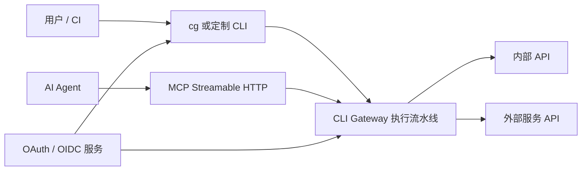

# CLI Gateway

简体中文 | [English](README.md)

[](https://github.com/wyh0626/cli-gateway/actions/workflows/ci.yml)
[](https://github.com/wyh0626/cli-gateway/actions/workflows/codeql.yml)
[](https://pkg.go.dev/github.com/wyh0626/cli-gateway)
[](LICENSE)

CLI Gateway 是一个 Go 实现的能力网关。它通过声明式配置，把 HTTP API 同时
转换成经过认证的 CLI 命令和 MCP Streamable HTTP 工具。CLI 与 MCP 共用身份
认证、策略、参数校验、下游凭证、限流、链路追踪和审计流水线。

> **项目状态：** 当前为 1.0 之前的开发版本。核心安全与执行链路已经测试，
> 但首个稳定版本发布前不保证配置格式完全兼容。

## 主要能力

- 为用户、CI 和 AI Agent 提供统一、可治理的 API 入口。
- 无需为每个服务单独开发客户端，服务端配置即可生成动态 CLI 命令。
- 从同一份 Manifest 生成 MCP 工具。
- CLI 支持 OIDC Authorization Code + PKCE 和 Device Authorization。
- 每个后端显式选择认证方式：`signed-identity`、RFC 8693
  `token-exchange`、`client-credentials`、用户级 `authorization-code`
  或经过评审的 `bearer-passthrough`。
- 命令白名单、风险等级、二次确认、限流、熔断、结构化错误、指标和审计。
- 支持构建相互隔离的企业定制 CLI。



## 选择快速上手方式

| 目标 | 预计时间 | 指南 |
|---|---:|---|
| 不注册账号，在本机跑通全部链路 | 5 分钟 | [内置演示](docs/getting-started.md) |
| 使用真实、完全本地的 OIDC 服务 | 10 分钟 | [Keycloak](docs/tutorials/keycloak.md) |
| 使用带免费计划的云端 OIDC 服务 | 15 分钟 | [Auth0 Device Flow](docs/tutorials/auth0.md) |
| 使用每个用户自己的身份代理 GitHub | 20 分钟 | [GitHub App](docs/tutorials/github.md) |

## 五分钟体验

需要 Docker Compose、`curl` 和 `jq`：

```bash
docker compose up --build -d

TOKEN="$(curl -fsS http://127.0.0.1:18080/token | jq -r .access_token)"
curl -fsS http://127.0.0.1:18082/readyz
curl -fsS -H "Authorization: Bearer $TOKEN" \
  http://127.0.0.1:18082/manifest | jq
curl -fsS -X POST \
  -H "Authorization: Bearer $TOKEN" \
  -H "Content-Type: application/json" \
  -d '{"args":{"delay-ms":5}}' \
  http://127.0.0.1:18082/exec/demo/work | jq

docker compose down
```

仓库内置的 issuer 和 API 仅用于本地开发，不能作为生产身份或业务服务。

## 构建

需要 Go 1.25.12 或更高版本：

```bash
make verify
make build

sudo install -m 0755 bin/cli-gateway bin/cg /usr/local/bin/
cli-gateway -manifest manifest.example.yaml
cg --help
```

也可以分别构建：

```bash
make build-gateway
make build-client
```

首个公开版本发布后，可以使用校验 SHA-256 的安装脚本安装最新版客户端：

```bash
curl --proto '=https' --tlsv1.2 -fsSL \
  https://raw.githubusercontent.com/wyh0626/cli-gateway/main/scripts/install.sh | sh
```

通过 `CG_VERSION=v0.3.0` 可以固定版本。生产环境执行下载脚本前应先审查脚本内容。

## 体验 CLI OAuth 登录

在三个终端中分别启动本地 issuer、示例 API 和网关：

```bash
go run ./cmd/devissuer
go run ./cmd/demoapi
go run ./cmd/cli-gateway -manifest examples/e2e/manifest.yaml
```

然后登录并执行动态命令：

```bash
export CG_SERVER=http://127.0.0.1:18082
cg login --device
# 打开终端输出的网址并确认设备码。
cg capabilities -o json
cg demo work --delay-ms 5 -o json
cg whoami
```

去掉 `--device` 会使用 Authorization Code + PKCE 和随机本地回调端口。CLI
只申请身份 Scope，命令权限不需要展示在 OAuth 授权页；最终业务权限仍由后端
系统判断。

`cg capabilities` 会返回当前身份可见的完整命令和参数结构，终端 AI 可以先发现
能力，不需要依赖一份重复且容易过期的命令清单：

```bash
CG_INVOKER=ai cg capabilities -o json
CG_INVOKER=ai cg demo stats -o json
```

## 接入 API 命令

从 [manifest.example.yaml](manifest.example.yaml) 开始：

```yaml
cli:
  name: cg

domains:
  - name: inventory
    upstream: https://inventory.example.com
    downstream_auth:
      mode: signed-identity
      identity_audience: inventory-api
    commands:
      - path: [item, get]
        summary: 查询资产
        method: GET
        endpoint: /v1/items/{id}
        risk: read
        flags:
          - name: id
            type: string
            required: true
            in: path
```

网关重载且客户端执行 `cg update-commands` 后，即可调用：

```bash
cg inventory item get --id server-42
```

同一命令也会通过 `/mcp` 暴露为 MCP 工具。服务端会对每次执行重新鉴权，
客户端本地缓存不具备授权能力。

## 后端用户授权

如果后端拥有独立的用户 OAuth 账号，可以配置 `authorization-code` 下游模式。
CLI Gateway 会加密保存后端 Refresh Token，并合并并发刷新。后端也可以在成功
响应中返回安全的 `open_url` 动作：

```json
{
  "status": "PENDING_USER_AUTHORIZATION",
  "userAction": {
    "type": "open_url",
    "url": "https://accounts.vendor.example/oauth/authorize?state=request-123",
    "message": "需要完成额外授权",
    "completionCommand": "cg inventory request get --id request-123"
  }
}
```

交互式 CLI 会展示目标域名，并在用户确认后打开 HTTPS 地址；无 TTY 环境只打印
链接。完成命令只会显示，不会被自动执行。

[GitHub App 教程](docs/tutorials/github.md)给出了一个完整可运行的例子：
使用 PKCE、`client_secret_post`、加密的用户级 Refresh Token 和只读 GitHub
命令。

## 构建定制 CLI

默认客户端名为 `cg`。可以构建一个完全隔离的客户端：

```bash
make build-client CLI_NAME=acme
./bin/acme --help

# 网关 Manifest 必须匹配：
# cli:
#   name: acme
```

`CLI_NAME=acme` 会自动派生 `ACME_*`、对应平台的 `acme` 配置和缓存目录、
`acme-cli-refresh-token` 以及 `acme-cli/<version>`。高级覆盖方式见
[定制 CLI 指南](docs/white-label-cli.md)。

## 认证边界

CLI 携带的 Token 只用于向 CLI Gateway 证明调用者身份。除非某个域显式启用并
经过安全评审的 Bearer Passthrough，否则不会把原 Token 转发给后端。

| 模式 | 适用场景 |
|---|---|
| `signed-identity` | 自有后端信任网关签发的短期用户身份 |
| `token-exchange` | 授权服务器支持 RFC 8693 用户委托 |
| `client-credentials` | 后端只需要应用身份 |
| `authorization-code` | 后端拥有独立的用户 OAuth 账号 |
| `bearer-passthrough` | 同一 Token 信任域内的特殊兼容方式 |

完整流程见[认证与身份指南](docs/authentication-and-identity-guide.md)。

## 向用户分发 CLI

容器内置 macOS 和 Linux 的 amd64/arm64 客户端及对应校验文件。使用 HTTPS
`server.public_url` 部署 CLI Gateway 后，用户只需一条命令即可安装客户端并
自动配置该网关：

```bash
curl --proto '=https' --tlsv1.2 -fsSL \
  https://gateway.example.com/install.sh | sh
cg login
cg capabilities
```

下载接口使用精确的产物白名单，不能读取容器内任意文件。生产使用前仍应先审查
安装脚本。

## 生产部署

```bash
docker build -t cli-gateway:local .
kubectl apply -f deploy/kubernetes/cli-gateway.yaml
```

上线前必须替换所有示例 issuer、audience、URL、镜像、密钥和 Secret，配置 TLS
和入口网关，为每个后端选择认证方式，并检查
[生产上线清单](docs/production-checklist.md)。

当前扩展边界：

- Token 缓存、限流器、熔断器、待处理的下游 OAuth 状态和 MCP Session 在进程内。
- 加密文件 Token Store 是单进程、单写者模型。
- 多副本下，有状态 MCP Session 需要负载均衡会话亲和。
- 全局配额和跨实例凭证缓存需要额外选择分布式实现。

## 验证

```bash
make verify
make test-race
```

官方 MCP Go SDK 集成测试：

```bash
go test ./internal/adapter/mcp -run TestStreamableHTTP
```

## 文档

- [文档索引](docs/README.md)
- [快速开始](docs/getting-started.md)
- [Auth0 教程](docs/tutorials/auth0.md)
- [Keycloak 教程](docs/tutorials/keycloak.md)
- [GitHub App 教程](docs/tutorials/github.md)
- [实现规格](docs/implementation-spec.md)
- [认证与身份](docs/authentication-and-identity-guide.md)
- [威胁模型](docs/threat-model.md)
- [定制 CLI](docs/white-label-cli.md)
- [生产上线清单](docs/production-checklist.md)
- [设计参考](docs/design-references.md)
- [路线图](docs/roadmap.md)
- [安全策略](SECURITY.md)
- [贡献指南](CONTRIBUTING.md)
- [支持](SUPPORT.md)
- [治理](GOVERNANCE.md)
- [变更记录](CHANGELOG.md)

## 许可证

本项目使用 [Apache License 2.0](LICENSE)。
