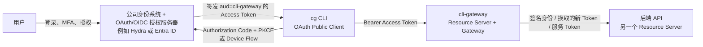
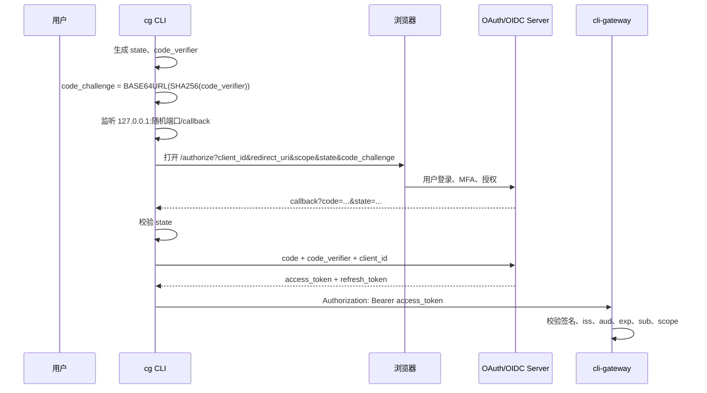
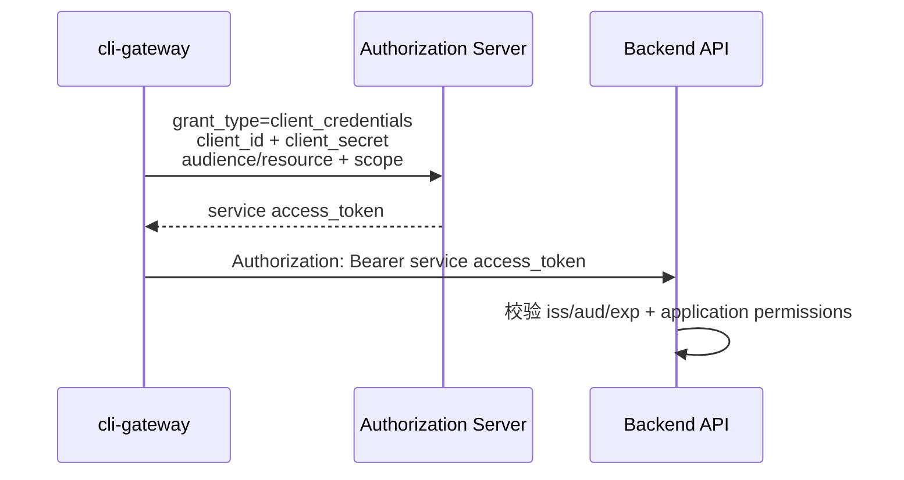
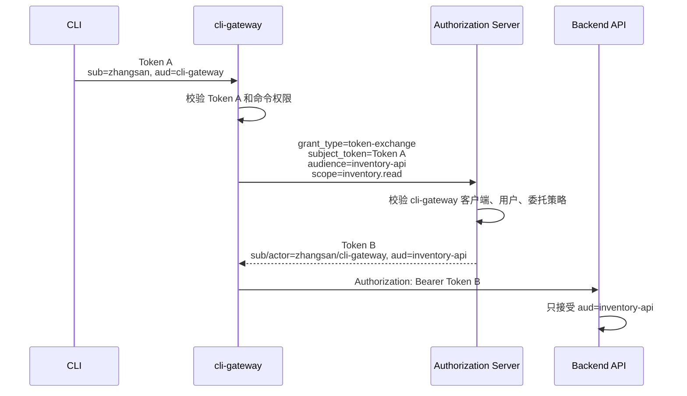
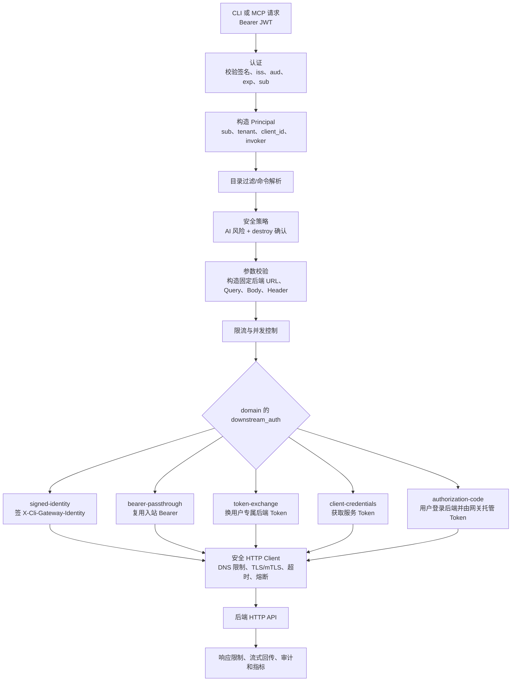
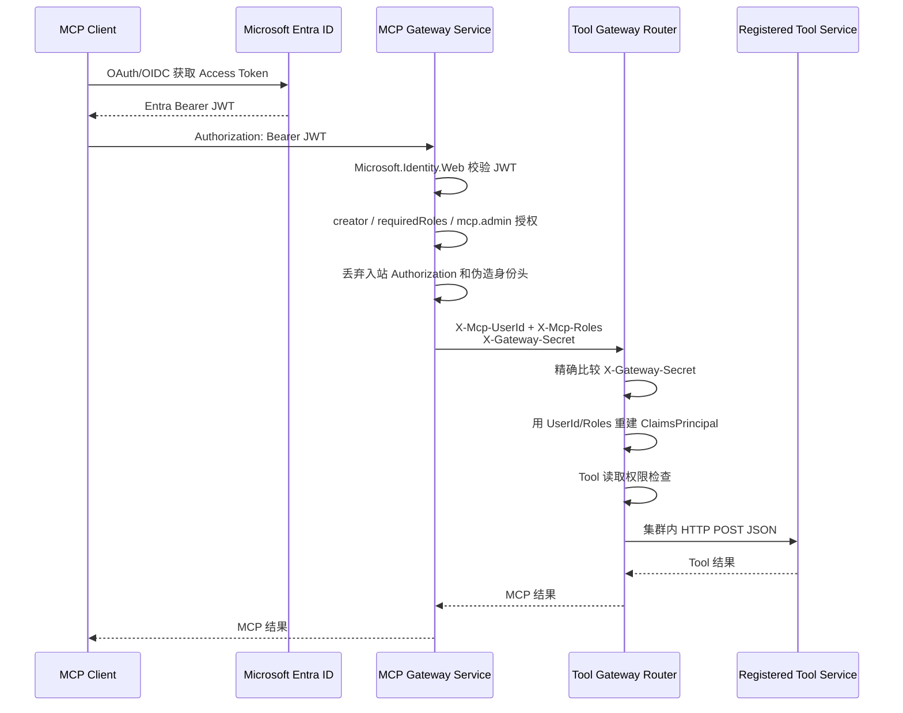

# CLI Gateway 认证、身份传递与用户系统接入指南

> 状态：基于 2026-07-27 的 `cli-gateway` 与 Microsoft `mcp-gateway` 本地代码审查<br>
> 原则：代码实现是“当前能力”的依据；设计建议与尚未实现的能力会明确分开。
> 文中的 `cg` 是默认品牌名；定制构建可替换为 `acme` 等名称，并自动隔离环境变量、
> 配置、缓存、Keyring 和 User-Agent。

## 1. 先给结论

1. PAT、Basic、OAuth、Client Credentials、Token Exchange 和身份头不是同一层面的六种等价方案：
   - PAT、Basic 是直接凭证；
   - OAuth 是令牌签发与授权框架；
   - Authorization Code + PKCE、Client Credentials、Token Exchange 是不同 OAuth 流程；
   - 身份头是网关向后端传递已认证身份的方式，必须额外解决“后端为什么相信这个头”。
2. `cli-gateway` 当前接收 CLI/MCP 客户端的方式是 `Authorization: Bearer <JWT>`。它通过 OIDC Discovery 或直接配置的 JWKS 校验 JWT，不接收用户名密码、PAT 或任意身份头作为用户登录凭证。
3. `cli-gateway -> 后端` 当前实现了五种认证模式：
   - `signed-identity`
   - `bearer-passthrough`
   - `token-exchange`
   - `client-credentials`
   - `authorization-code`（方案 C）
4. `cli-gateway` 还支持后端 HTTPS、自定义 CA 和 mTLS，但 mTLS 属于传输层/工作负载认证，可以与上述模式组合使用。
5. 当前没有“静态 PAT”“后端 Basic Auth”“静态 API Key”这三类后端凭证提供器。OAuth Token Endpoint 默认使用 `client_secret_basic`，也可以按后端域显式选择 `client_secret_post`；这不等于后端业务 API 支持 Basic Auth。
6. `cli-gateway` 当前不是通用透明反向代理。它把清单中的 CLI 命令或 MCP Tool 映射为受约束的 HTTP API 请求，后端目前必须提供 HTTP/HTTPS API。
7. `cli-gateway` 不需要自己管理账号和密码。它依赖公司用户系统与 OAuth/OIDC 授权服务器完成登录、用户生命周期和令牌签发；`cli-gateway` 负责令牌校验、命令白名单、安全风险控制和审计，最终业务权限由后端判断。
8. Microsoft `mcp-gateway` 不只是转发器，它同时包含控制面、数据面、Kubernetes 生命周期管理、会话路由和权限管理。其数据面确实把 MCP 请求转发到集群内部服务。
9. Microsoft 的 `X-Gateway-Secret` 是网关和 Tool Gateway 共享的服务间密钥。Tool Gateway 比较请求头与本地配置；匹配后才信任 `X-Mcp-UserId` 和 `X-Mcp-Roles`。它不是 Entra 用户令牌，也不是逐请求签名。
10. Microsoft Entra ID 是原 Azure Active Directory：既是企业用户/应用目录，也是 OAuth 2.0/OIDC 身份平台和令牌签发方。

## 2. 先区分四个角色



- 用户：自然人账号。
- CLI：OAuth Public Client。二进制里不能安全保存 `client_secret`。
- 授权服务器：认证用户并签发 Token。Hydra/Entra ID 属于这一层。
- cli-gateway：验证发给自己的 Token，做命令授权，然后用后端认可的凭证访问 API。
- 后端 API：不应无条件相信来自公网的用户头或任意 Token，只信任自己的 audience、网关签名或受保护的服务通道。

“用户登录 cli-gateway”和“cli-gateway 登录后端”是两段独立的认证关系，不能混成一个问题。

## 3. 六类认证方式的原理

### 3.1 PAT：Personal Access Token

PAT 是服务为某个用户创建的一段长期随机字符串。常见调用形式：

```http
Authorization: Bearer <PAT>
```

也有服务使用专有头：

```http
X-Api-Key: <PAT>
```

服务端通常保存 PAT 的哈希、所有者、权限范围和过期时间。收到请求后，对 Token 做哈希并查表，确认：

- Token 是否存在；
- 是否过期或撤销；
- 属于哪个用户；
- 是否具备请求所需权限。

特点：

- 优点：简单，适合人工操作旧系统或快速集成。
- 缺点：通常生命周期长；泄漏后可直接重放；轮换、吊销和审计成本高。
- PAT 代表创建它的用户，通常不是网关自身。
- PAT 不是 OAuth Access Token，虽然两者经常都放在 Bearer Header 中。

网关使用 PAT 时，不应让每个 CLI 用户把 PAT 传给网关。更合理的遗留系统兼容方式是：

- PAT 由平台 Secret Manager 托管；
- cli-gateway 根据后端域读取对应 Secret；
- 用户只能触发被授权的命令，不能读取 PAT；
- 后端审计会看到共享技术账号，若要保留用户身份，需要同时传递可信身份断言。

### 3.2 Basic Authentication

Basic 的请求形式：

```http
Authorization: Basic BASE64(username:password)
```

Base64 只是编码，不是加密。任何拿到请求内容的人都能恢复用户名和密码，因此 Basic 必须运行在可信 HTTPS 上。

特点：

- 每次请求都发送可重复使用的用户名密码；
- 难以做精细 scope、短时凭证和委托；
- 适合少量旧系统或 OAuth Token Endpoint 的客户端认证；
- 不适合现代 CLI 用户登录。

Basic 有两个常见但含义不同的使用位置：

1. `客户端 -> 业务 API`：直接用业务用户名密码，属于遗留模式。
2. `OAuth Confidential Client -> Token Endpoint`：用 `client_id/client_secret` 证明“哪个应用在申请 Token”，随后业务 API 只接收 Access Token。

`cli-gateway` 当前只使用第二种：请求 Token Endpoint 时默认调用 HTTP Basic；
对于 GitHub App 等有明确要求的 Provider，可以配置
`token_endpoint_auth_method: client_secret_post`。它没有实现第一种后端
Basic Provider。

### 3.3 OAuth 2.0 / OpenID Connect 与 Authorization Code + PKCE

OAuth 2.0 是授权框架，不是一种固定 Token 格式，也不等于“登录”。OIDC 在 OAuth 2.0 上增加用户身份语义。

CLI 最适合 Authorization Code + PKCE：



PKCE 解决的是“授权码被截获后被别的进程兑换”的问题：

- CLI 先生成只存在本地内存中的 `code_verifier`；
- 发起授权时只发送它的 SHA-256 派生值 `code_challenge`；
- 换 Token 时必须提交原始 `code_verifier`；
- 截获授权码但没有 verifier 的攻击者无法兑换 Token。

关键 Token：

- Access Token：给 API 使用，短期有效，`aud` 应指向目标 API，例如 `cli-gateway`。
- ID Token：给客户端了解“谁登录了”，不能代替 API Access Token。
- Refresh Token：给 CLI 向授权服务器刷新 Access Token，不发送给 cli-gateway 或后端 API。

CLI 是 Public Client：

- 可以公开 `client_id`；
- 不能在安装包中保存 `client_secret`；
- 必须使用 PKCE S256；
- 回调使用 loopback URI 或使用 Device Authorization Grant；
- Refresh Token 应放在操作系统 Keyring，并启用轮换和撤销。

### 3.4 Client Credentials

Client Credentials 表示“应用以自己身份调用 API”，没有最终用户。



适合：

- 后台任务；
- 只需要证明“请求来自 cli-gateway”；
- 不需要后端按最终用户授权。

不适合：

- 后端必须知道具体用户；
- 需要“张三能做、李四不能做”的用户级权限；
- 审计必须明确到最终用户，且没有额外可信身份断言。

一个还是多个 Client：

- 协议没有要求“每个后端必须一个 Client”；
- 一个 cli-gateway Client 可以在授权服务器允许时申请多个 audience/scope；
- 生产建议按安全边界拆分，例如高风险生产 API 与普通查询 API 使用不同 Client；
- `cli-gateway` 当前在每个 domain 的 `client_credentials` 配置中设置 Client，因此可以复用同一 Client，也可以每个 domain 使用不同 Client。

### 3.5 Token Exchange

Token Exchange（RFC 8693）解决“网关已经拿到用户访问 cli-gateway 的 Token，但后端需要另一个 audience 的 Token”。



核心价值：

- Token A 不会直接暴露给后端；
- Token B 只能访问指定后端 audience/resource；
- 可以缩小 scope 和有效期；
- 授权服务器统一决定 cli-gateway 是否可以代表该用户访问该后端；
- 后端使用标准 OAuth/JWT 校验，不需要信任自定义明文用户头。

Token Exchange 不是简单“换个字符串”。授权服务器必须支持该 Grant，并配置：

- cli-gateway 是可信交换客户端；
- 哪些 subject token issuer 可以交换；
- 可以换到哪些 audience/resource；
- 可以申请哪些 scope；
- 最终 Token 如何表达用户和网关 actor。

缓存必须按用户/会话、目标 audience、scope、domain、客户端和配置版本隔离。Client Credentials 可以按服务共享缓存；Token Exchange 不能把张三的 Token B 给李四使用。

一个还是多个 Client：

- 一个受信任的 cli-gateway Client 可以被授权交换到多个后端；
- 安全上仍建议按强隔离域拆分 Client 或至少拆分密钥和授权策略；
- 不需要为每个 CLI 用户创建 OAuth Client；用户身份来自 `subject_token`。

### 3.6 身份头

身份头是网关告诉后端“我已经认证过这个用户”的方式，例如：

```http
X-User-Id: zhangsan
X-User-Roles: inventory.reader,ops
```

单独出现的身份头没有安全性。客户端也能自己构造相同头。后端必须回答：

> 我如何证明这些头确实由受信任网关生成，并且中途没有被篡改？

常见方案：

1. 网络隔离 + 共享密钥：
   - 网关增加 `X-Gateway-Secret`；
   - 后端只在 Secret 匹配后信任身份头；
   - 简单，但任何获得 Secret 的服务都能伪造任意用户和角色。
2. mTLS：
   - 后端验证调用方客户端证书；
   - 证明请求来自某个网关工作负载；
   - 用户头本身仍没有逐字段签名。
3. 签名身份断言：
   - 网关把用户、audience 和过期时间签成短期 JWT；
   - 后端用网关 JWKS 校验；
   - 可以防篡改、限制 audience 和有效期，是 `cli-gateway signed-identity` 的方案。
4. Token Exchange：
   - 让统一授权服务器签发后端标准 Access Token；
   - 对已有 OAuth Resource Server 最自然。

`cli-gateway` 的 `X-Cli-Gateway-Identity` 与 Microsoft 的 `X-Mcp-UserId` 不同：

| 项目 | cli-gateway | Microsoft mcp-gateway |
|---|---|---|
| 用户数据载体 | 一个 ES256 JWT | 明文 `X-Mcp-UserId`、`X-Mcp-Roles` |
| 调用方证明 | JWT 签名，公钥通过 `/jwks` 发布 | `X-Gateway-Secret` 共享密钥 |
| 防字段篡改 | JWT 字段被签名 | 依赖请求只能由持有共享 Secret 的网关发出 |
| audience | JWT 内置 `aud` | 没有逐请求 audience |
| 过期 | JWT 一分钟过期 | Secret 本身没有逐请求过期 |
| 轮换 | `kid` + 当前/旧公钥窗口 | 同步轮换共享 Secret |

## 4. 如何选择

| 场景 | 推荐方式 | 原因 |
|---|---|---|
| CLI 用户登录 cli-gateway | Authorization Code + PKCE | Public Client 无密钥，保留用户身份 |
| 无浏览器终端登录 | Device Authorization Grant | 适合 SSH/服务器终端 |
| 后端支持标准用户委托 OAuth | Token Exchange | audience 隔离，保留最终用户 |
| 后端只关心请求来自 cli-gateway | Client Credentials | 服务身份清晰、标准化 |
| 公司自研后端，可接入网关 JWKS | signed-identity | 轻量、短时、命令级身份断言 |
| cli-gateway 与后端本来就共享同一 audience | bearer-passthrough，谨慎使用 | 无需换 Token，但扩大原 Token 暴露范围 |
| 不支持 OAuth 的遗留 API | Secret Manager 托管 PAT/Basic 的专用 Provider | 兼容旧系统，避免用户持有后端 Secret |
| 内部明文身份头 | 至少共享 Secret/mTLS；更推荐签名断言 | 不能直接信任用户可控 Header |

## 5. cli-gateway 当前实际支持什么

### 5.1 CLI/MCP 客户端访问 cli-gateway

当前受保护端点只接受：

```http
Authorization: Bearer <JWT access token>
```

校验内容：

- 允许的签名算法只有 ES256 和 RS256；
- 验证 JWT 签名和 `kid`；
- 验证 `iss`；
- 验证 `aud=cli-gateway`（以配置为准）；
- 验证 `exp` 等时间声明；
- 要求 `sub`；
- 可提取 `scope` 或 `scp` 作为身份信息，但不用于命令授权；
- 可提取 `tid/tenant_id`、`sid`、`invoker`、`client_id/azp`。

两种 `auth.mode` 的差别只在获取 JWKS 的方式：

- `oidc`：从 `issuer/.well-known/openid-configuration` 发现 `jwks_uri`；
- `trusted-header`：直接使用配置的 `trusted_jwks`。

注意：当前名为 `trusted-header` 的模式仍然验证 Bearer JWT，它并不会信任 `X-User-*` 这类身份头。

CLI 当前支持：

- Authorization Code + PKCE S256；
- 127.0.0.1 随机端口 loopback callback；
- Device Authorization Grant；
- Access Token 只保存在进程内存；
- Refresh Token 保存在操作系统 Keyring；
- Refresh Token 轮换；
- Logout 时尽力调用撤销端点；
- Access Token 过期时安全地刷新一次。

### 5.2 cli-gateway 请求流水线



### 5.3 cli-gateway 到后端的五种模式

#### signed-identity

```yaml
downstream_auth:
  mode: signed-identity
  identity_audience: inventory-api
```

cli-gateway 为每次调用签发一分钟有效的 ES256 JWT，放入：

```http
X-Cli-Gateway-Identity: <signed JWT>
```

JWT 包含 `iss=cli-gateway`、后端 audience、用户 `sub`、invoker 和 trace ID，不包含 cli-gateway 命令或权限。后端必须从 cli-gateway `/jwks` 获取公钥，校验算法、签名、`kid`、`iss`、`aud` 和 `exp`，并使用自己的用户、角色和数据权限完成最终授权。

该 JWT 当前按请求签发，用 trace ID 关联审计，但不会再次请求 Hydra。ES256 本地签名成本远低于远程换 Token；如果以后需要缓存，可按用户和后端 audience 复用，而不是按命令拆分。

#### bearer-passthrough

```yaml
downstream_auth:
  mode: bearer-passthrough
```

把已经通过 cli-gateway 验证的入站 Bearer JWT原样发给后端。只有后端明确接受同一 issuer、同一 Token audience 合同时才应使用。

风险：

- 用户 Token 暴露给更多服务；
- 后端可能错误接受 `aud=cli-gateway` 的 Token；
- 任一后端泄漏都扩大 Token 重放范围。

它不能用于透传 GitHub PAT 等任意 Token，因为入站 Token 必须先通过 cli-gateway 的 JWT issuer/audience 校验。

#### token-exchange

```yaml
downstream_auth:
  mode: token-exchange
  token_exchange:
    token_url: https://auth.example.com/oauth2/token
    client_id: cli-gateway-inventory
    client_secret_ref: env:CLI_GATEWAY_CMDB_CLIENT_SECRET
    audience: inventory-api
    scopes: [inventory.read]
  cache:
    capacity: 10000
    refresh_skew: 30s
    negative_ttl: 2s
```

cli-gateway 使用 RFC 8693 的 `subject_token` 换取后端 Token。Token Endpoint
默认使用 `client_id/client_secret` 的 HTTP Basic Client Authentication。如
授权服务器要求在表单中提交客户端凭证，可显式添加：

```yaml
token_endpoint_auth_method: client_secret_post
```

#### client-credentials

```yaml
downstream_auth:
  mode: client-credentials
  client_credentials:
    token_url: https://auth.example.com/oauth2/token
    client_id: cli-gateway-job
    client_secret_ref: file:/var/run/secrets/cli-gateway-job
    audience: job-api
    scopes: [job.execute]
```

cli-gateway 获取服务身份 Token。所有用户共享“service”维度的缓存项；后端 Token 不代表最终用户。

#### authorization-code（方案 C）

适用于 GitHub、云平台或其他拥有独立用户体系、又不信任公司 issuer 的后端：

```yaml
downstream_oauth:
  token_store_file: /var/lib/cli-gateway/downstream-oauth.enc
  encryption_key_ref: env:CLI_GATEWAY_OAUTH_STORE_KEY
  state_ttl: 5m

domains:
  - name: vendor
    downstream_auth:
      mode: authorization-code
      authorization_code:
        authorization_url: https://accounts.vendor.example/oauth2/authorize
        token_url: https://accounts.vendor.example/oauth2/token
        revocation_url: https://accounts.vendor.example/oauth2/revoke
        client_id: cli-gateway-vendor
        client_secret_ref: env:CLI_GATEWAY_VENDOR_CLIENT_SECRET
        token_endpoint_auth_method: client_secret_basic
        scopes: [items.read, offline_access]
```

用户仍然先用公司 PKCE 登录 CLI。第一次访问该 domain 时，CLI 收到
`E_DOWNSTREAM_AUTH_REQUIRED`，打开后端授权页面；cli-gateway 用一次性 state 和
PKCE 完成回调，并按“公司 issuer + tenant + 用户 sub + domain + 配置摘要”
加密保存后端 Refresh Token。以后请求直接使用缓存的 Access Token，临近
过期时自动刷新；同一用户同一 domain 的并发刷新只请求一次 Token Endpoint。
`cg disconnect` 会尽力调用配置的撤销端点，并且无论远端撤销是否成功都会删除
本地密文 Token。

也可以手动执行：

```bash
cg authorize vendor
cg disconnect vendor
```

CLI 不接触后端 Token，浏览器回调 URL 固定为
`<server.public_url>/oauth/downstream/callback`。生产环境必须配置绝对路径的
`token_store_file` 和至少 32 字节高熵的加密密钥引用。当前文件存储面向
单 cli-gateway 进程；多副本需要共享且具备原子锁的 Token/授权状态存储后端。

部分 Provider 不使用 OAuth Scope 表达应用权限。例如 GitHub App 的权限在应用
设置中配置，因此 `authorization-code.scopes` 可以为空，并使用
`token_endpoint_auth_method: client_secret_post`。完整步骤见
[GitHub App 教程](tutorials/github.md)。

### 5.4 入站 OAuth Provider 参数兼容

不同 OIDC Provider 选择目标 API 的参数并不完全相同。`auth.resource_parameter`
控制 CLI 在授权、Device Flow、Token 和刷新请求中发送的参数：

| 值 | 发送参数 | 常见场景 |
|---|---|---|
| `both` | `resource` 和 `audience` | 默认，兼容已有部署 |
| `audience` | 仅 `audience` | Auth0 自定义 API |
| `resource` | 仅 `resource` | RFC 8707 Provider |
| `none` | 都不发送 | Keycloak 使用 Audience Mapper |

这只影响 CLI 登录 cli-gateway 的 Token 获取，不改变网关到后端的认证模式。

### 5.5 Token 缓存现状

Token Exchange 和 Client Credentials Token 使用进程内缓存；方案 C 使用
加密持久化存储，并在进程内合并并发刷新。共同特性包括：

- 进程内、有界 LRU；
- HMAC 不透明缓存键；
- 提前刷新窗口；
- 相同 key 的并发请求合并，只发一次 Token 请求；
- 短暂的 429/5xx/超时负缓存；
- 刷新失败时，在 Token 仍未硬过期的情况下可使用旧 Token；
- 后端返回 401 时使对应缓存失效。

隔离维度包含 issuer、tenant、用户/会话、调用方 client、domain、模式、配置摘要、audience/resource、scope 和 requested token type。

当前边界：

- 缓存是进程内的；
- 多副本之间不共享；
- 重启或清单 generation 更新后重新获取；
- 当前没有 Redis Token Cache，现有实现规格中提到的 Redis 扩展不是当前代码能力；
- 用户被停用后，已经交换出的后端 Token 最长可能继续有效到自身过期，因此生产应设置短 TTL，并设计撤销/事件失效策略。

### 5.6 cli-gateway 是不是只对接后端 API

答案是：当前后端数据面只对接 HTTP/HTTPS API，但它不是无约束的通用反向代理。

当前支持：

- 后端 base URL + 固定 endpoint；
- GET、POST、PUT、PATCH、DELETE；
- path/query/body/header 参数映射；
- JSON 请求；
- HTTP 流式响应；
- TLS、自定义 CA、mTLS；
- 每个 domain 的认证、并发、速率和熔断。

当前不直接支持：

- 在网关机器执行本地 shell；
- 直接调用 SDK 函数；
- 直接连接数据库；
- gRPC 后端；
- stdio 后端；
- 把后端 MCP Server 当作上游 MCP 聚合。

CLI `/exec` 和 MCP `tools/call` 只是两个前端协议适配器，它们最终调用同一套 invocation service。若后端不是 HTTP API，应增加一个薄 HTTP Adapter，或以后新增明确的上游协议 Provider。

### 5.7 当前没有实现的后端认证方式

| 方式 | 当前状态 | 说明 |
|---|---|---|
| 静态 PAT/静态 Bearer | 未实现 | 没有从 Secret Ref 读取固定 Token 的 Provider |
| 后端 Basic Auth | 未实现 | Token Endpoint 的 Basic 不算业务 API Basic |
| 静态 API Key | 未实现 | 命令参数不能设置受保护的 Authorization；也不应让用户输入共享 Secret |
| 明文用户身份头 | 未实现且不建议 | 使用签名 `X-Cli-Gateway-Identity` 替代 |
| mTLS | 已实现 | `tls.client_cert_file/client_key_file`，可与五种模式组合 |

如果后续必须兼容 PAT/Basic/API Key，建议新增独立 `static-secret` Provider：

- Secret 只能来自 `env:`、`file:` 或企业 Secret Manager；
- 禁止进入清单明文、日志、审计和命令参数；
- 支持轮换；
- 每个后端域独立 Secret；
- 继续保留 cli-gateway 的命令白名单、安全策略和最终用户审计；业务授权仍由后端执行。

## 6. cli-gateway 是否需要用户管理

### 6.1 推荐边界

`cli-gateway` 不应管理：

- 用户名和密码；
- MFA；
- 找回密码；
- 组织目录；
- 用户注册/禁用；
- 登录 Session UI；
- OAuth Consent UI。

这些应由公司身份系统负责。若使用 Ory：

- Hydra 负责 OAuth 2.0/OIDC 协议、授权码、Access/Refresh Token；
- 用户登录、账号和 MFA 通常由 Kratos、公司 SSO、LDAP/AD 或自有用户系统负责；
- Hydra 的 login/consent 应用把用户身份和授权决定交回 Hydra。

`cli-gateway` 应负责：

- 验证 Access Token；
- 把 `sub` 作为稳定用户主键；
- 只允许调用 manifest 中声明的命令；
- 风险、确认、限流和审计；
- 管理服务目录与后端凭证；
- 必要时保存最小化的授权投影或策略缓存，而不是用户密码。

当前 `cli-gateway` 没有本地用户表，也不根据 JWT scope、roles 或 groups
决定业务权限。后端根据 cli-gateway 传递并签名的用户身份，使用自身权限模型授权。

### 6.2 CLI 接入时用户系统需要改造什么

| 改造项 | 必需内容 |
|---|---|
| 注册 CLI OAuth Client | Public Client，例如 `cg-cli`；无 client secret；允许 Authorization Code + PKCE S256 |
| 回调地址 | 允许 `http://127.0.0.1:<port>/callback` 的 loopback 模式；若授权服务器不支持随机端口，CLI 与 Client 注册需统一固定端口策略 |
| Device Flow | 可选，但服务器/SSH 场景建议启用 Device Authorization Grant |
| 注册 cli-gateway Resource/API | 定义 audience，例如 `cli-gateway` 或 `api://<cli-gateway-client-id>` |
| Login Scope | 只申请 `openid`、`offline_access`、`email`、`profile` 等身份与会话 scope |
| 用户/组到权限的映射 | 不需要为 cli-gateway 映射命令 scope；业务系统继续使用自身角色和数据权限 |
| JWT Claims | 至少包含 `iss`、`aud`、`sub`、`exp`；按身份映射需要提供 email/name，建议含 `azp/client_id`、`sid`、`tid` |
| Refresh Token | 为 `offline_access` 签发 Refresh Token，启用轮换、撤销和合理生命周期 |
| 生命周期 | 用户禁用、离职、组权限变化后，停止新 Token/Refresh，并考虑短 Access Token TTL |
| Discovery/JWKS | 提供标准 OIDC Metadata 与 HTTPS JWKS，支持签名密钥轮换 |
| 审计关联 | `sub` 必须稳定；email/name 仅用于展示，不能作为长期授权主键 |

### 6.3 推荐 Claims 合同

一个给 cli-gateway 的 Access Token 至少应表达：

```json
{
  "iss": "https://auth.example.com",
  "aud": "cli-gateway",
  "sub": "immutable-user-id",
  "exp": 0,
  "scope": "openid email profile",
  "azp": "cg-cli",
  "sid": "login-session-id",
  "tid": "company-or-tenant-id",
  "invoker": "human"
}
```

注意：

- `openid`、`profile`、`email`、`offline_access` 是登录、身份声明和 Token 生命周期相关 scope，不代表业务命令权限；
- cli-gateway 不再定义 `inventory:item:read`、`inventory:item:create` 等命令 scope；
- cli-gateway 不按 `scope/scp`、Entra `roles` 或公司 `groups` 做业务授权；
- 使用 `auth.identity_claims` 把授权服务器中的 email/name 声明映射为下游身份字段；
- 公司角色、组和数据权限继续由收到签名用户身份的业务系统解释和执行。

### 6.4 cli-gateway 和用户系统分别保存什么

| 数据 | 保存位置 |
|---|---|
| 用户密码、MFA、账号状态、组 | 公司用户系统 |
| OAuth Client、授权码、Refresh Token 状态 | Hydra/Entra 等授权服务器 |
| CLI Refresh Token | 用户机器 OS Keyring |
| CLI Access Token | CLI 进程内存 |
| cli-gateway 用户 Access Token | 只在请求期间使用，不持久化 |
| 后端交换 Token/服务 Token | cli-gateway 有界短期缓存 |
| 命令目录和风险 | cli-gateway manifest |
| 用户业务权限 | 后端业务系统 |
| 操作审计 | cli-gateway audit sink，禁止记录原始 Token |

## 7. Microsoft mcp-gateway 的认证与内部转发

### 7.1 它不只是“把请求转发到内部服务”

该项目同时包含：

- 数据面：
  - `/adapters/{name}/mcp` 转发到指定 MCP Adapter；
  - `/mcp` 转发到 Tool Gateway Router；
  - MCP session affinity 和分布式 session route。
- 控制面：
  - Adapter、Tool、Agent、Session 管理；
  - Kubernetes 部署、更新、删除和状态；
  - 元数据存储；
  - 创建者、required roles、管理员权限判断。
- 身份面：
  - 生产使用 Entra Bearer JWT；
  - 开发环境可使用 `X-Dev-*` 模拟身份；
  - 把认证后的身份转成内部头。

所以“数据请求最终转发到内部服务”是对的，但它还有明显的控制面和资源管理能力。

### 7.2 实际调用流水线



一个重要边界：当前 `HttpToolExecutor` 从 Tool Gateway Router 调用最终工具服务时，只向集群内 DNS 地址发送 JSON，并没有继续转发 Entra Token、用户身份头或 `X-Gateway-Secret`。用户授权是在 Tool Gateway Router 这一层完成的，最终 Tool Service 被当作集群内部执行端。

对于直接 Adapter 代理路径，Gateway 也会注入身份头和共享 Secret；具体 Adapter 若要使用这些身份，必须自己实现相同的校验。当前代码中可以确认完整校验实现的是 Microsoft Tool Gateway。

### 7.3 X-Gateway-Secret 如何校验

外层 Gateway：

1. 忽略客户端传来的 `Authorization`；
2. 忽略客户端传来的 `X-Mcp-UserId`、`X-Mcp-Roles`、`X-Gateway-Secret`；
3. 从已经认证的 `ClaimsPrincipal` 重新生成 User ID 和 Roles；
4. 从 `GatewaySettings:Secret` 读取共享密钥；
5. 注入 `X-Gateway-Secret`。

Tool Gateway：

1. 非开发环境启动时，如果没有 `GatewaySettings:Secret`，直接启动失败；
2. 每个请求读取 `X-Gateway-Secret`；
3. 使用大小写敏感的精确字符串比较；
4. 不存在或不一致则返回 401；
5. Secret 通过后才读取 `X-Mcp-UserId` 和 `X-Mcp-Roles` 并构造身份。

等价的后端伪代码：

```go
func gatewayOnly(next http.Handler, expectedSecret string) http.Handler {
    return http.HandlerFunc(func(w http.ResponseWriter, r *http.Request) {
        if expectedSecret == "" || r.Header.Get("X-Gateway-Secret") != expectedSecret {
            http.Error(w, "unauthorized", http.StatusUnauthorized)
            return
        }

        // 只有 Secret 校验通过后，才可以读取这些头。
        userID := r.Header.Get("X-Mcp-UserId")
        roles := r.Header.Values("X-Mcp-Roles")
        _ = userID
        _ = roles
        next.ServeHTTP(w, r)
    })
}
```

生产部署要求：

- Gateway 和 Tool Gateway 从同一个 Kubernetes Secret/Secret Manager 注入值；
- Secret 使用足够长度的随机值；
- 两个服务都不把 Secret 写入日志；
- NetworkPolicy 禁止普通 Pod 直接访问 Tool Gateway；
- 外部 Ingress 不能绕过外层 Gateway；
- 设计重叠轮换窗口，避免一次性切换导致中断；
- 更高安全要求下改用 mTLS 或短期签名身份断言。

共享 Secret 的边界：

- 它证明“调用者知道共享 Secret”，不直接证明具体用户；
- 任一能读取 Secret 的 Pod 都能伪造任意 `X-Mcp-UserId/Role`；
- 所有副本共享同一个长期 Secret，泄漏半径较大；
- 当前比较不是逐请求 MAC，Header 内容本身没有独立签名和过期时间；
- 因此必须结合 Secret 最小暴露、网络隔离和轮换。

### 7.4 Entra ID 是什么

Microsoft Entra ID（原 Azure AD）包括：

- 企业用户、组、应用和 Service Principal 目录；
- 用户登录、MFA、条件访问；
- OAuth 2.0/OIDC Authorization Server；
- 应用注册、Redirect URI、Client ID；
- API audience、delegated scopes 和 application roles；
- JWT Access Token 签发及签名密钥发布。

在 Microsoft `mcp-gateway` 中：

- 客户端先从 Entra 获取发给 Gateway API 的 Access Token；
- Gateway 使用 `AddMicrosoftIdentityWebApi` 验证 Token；
- Token 中的用户标识和 `roles` 进入 `ClaimsPrincipal`；
- `SimplePermissionProvider` 按资源创建者、`requiredRoles` 和 `mcp.admin` 判断权限；
- MCP challenge handler 发布受保护资源元数据和 Entra Authorization Server 地址，本身不是 Token 校验器。

另一个容易混淆的概念是 `DefaultAzureCredential`：

- 它用于 Gateway 工作负载访问 Cosmos DB、Azure AI Foundry 等 Azure 资源；
- 来源可能是 AKS Managed Identity 或本地 `az login`；
- 它不是终端用户访问 MCP Gateway 的 Token Exchange，也不会把用户身份委托给后端工具。

## 8. cli-gateway 推荐的生产认证组合

### 8.1 用户访问 cli-gateway

- 公司 OAuth/OIDC；
- `cg-cli` 注册为 Public Client；
- Authorization Code + PKCE S256；
- Device Flow 作为无浏览器补充；
- Access Token audience 只指向 cli-gateway；
- 登录只申请身份 scope，不把后端命令权限放到 consent 页面；
- Access Token 短期有效，Refresh Token 轮换并可撤销。

### 8.2 cli-gateway 访问后端

优先级建议：

1. 后端已经是公司 OAuth Resource Server：`token-exchange`。
2. 后端拥有独立用户体系且要求用户授权：`authorization-code`（方案 C）。
3. 后端只允许服务身份：`client-credentials`，必要时额外传签名审计身份。
4. 自研内部后端、希望轻量接入：`signed-identity` + TLS/mTLS。
5. 同一 issuer/audience 的受控迁移场景：评审后 `bearer-passthrough`。
6. 遗留 PAT/Basic/API Key：新增专门的 Secret Provider，不允许用户从命令行提交共享 Secret。

### 8.3 不推荐

- 把 CLI 登录 Token 无条件转发给所有后端；
- 让后端只看 `X-User-Id` 而没有网关证明；
- 把 Client Secret 编译进 CLI；
- 为每个用户创建 OAuth Client；
- 把 Refresh Token 发给 cli-gateway；
- 每个请求都远程 Token Exchange 且完全不缓存；
- 用 email 作为不可变授权主键；
- 把 Access Token、Refresh Token、PAT 或 Client Secret 写入日志。

## 9. 当前 cli-gateway 上线前需要确认的事项

1. 公司授权服务器是否支持：
   - Authorization Code + PKCE；
   - loopback callback 的随机端口，或确定固定端口方案；
   - Refresh Token 与轮换；
   - Device Flow（若需要）；
   - RFC 8693 Token Exchange（使用该模式时）。
2. cli-gateway audience、CLI public client ID 和身份 scopes 是否已注册。
3. 每个后端如何根据签名用户身份执行角色、组织和数据权限判断。
4. 每个后端 domain 选择哪种认证模式。
5. Token Exchange/Client Credentials 是否按风险域拆分 Client 和 Secret。
6. signed-identity 后端是否完成 JWKS、issuer、audience、expiry 和算法校验。
7. Token Cache 以及方案 C 文件存储/回调 state 的单进程边界是否满足部署方式。
8. 用户离职/禁用后，Refresh Token、短期 Access Token和已交换后端 Token 的最长残留时间是否可接受。
9. 所有 Secret 是否来自环境、文件挂载或企业 Secret Manager。
10. 网络策略是否阻止绕过 cli-gateway 直接访问内部 API。

## 10. 代码依据

### cli-gateway

- 入站 JWT 校验：`internal/auth/verifier.go`
- OIDC Discovery：`internal/auth/discovery.go`
- Bearer Header 解析：`internal/auth/bearer.go`
- CLI PKCE、Device Flow、Refresh/Keyring：`client/internal/oauth/manager.go`
- 后端五种认证 Provider：`internal/credential/manager.go`
- RFC 8693 与 Client Credentials 请求：`internal/credential/oauth.go`
- 方案 C 授权、刷新和隔离：`internal/credential/authorization_code.go`
- 方案 C 加密持久化：`internal/credential/authorization_store.go`
- Token Cache：`internal/cache/token.go`
- signed-identity JWT：`internal/identity/signer.go`
- 命令授权：`internal/policy/policy.go`
- HTTP 请求构造：`internal/invoke/request.go`
- 统一调用流水线：`internal/invoke/service.go`
- Manifest 校验与受保护 Header：`internal/manifest/validate.go`

### Microsoft mcp-gateway

- Entra JWT 配置：`dotnet/Microsoft.McpGateway.Service/src/Program.inventory`
- 外层代理剥离并重建身份头：`dotnet/Microsoft.McpGateway.Service/src/HttpProxy.inventory`
- Adapter/Tool Gateway 会话代理：`dotnet/Microsoft.McpGateway.Service/src/Controllers/AdapterReverseProxyController.inventory`
- Tool Gateway 共享密钥和身份重建：`dotnet/Microsoft.McpGateway.Tools/src/Program.inventory`
- Tool Gateway 到最终 Tool Service：`dotnet/Microsoft.McpGateway.Tools/src/Services/HttpToolExecutor.inventory`
- 资源权限：`dotnet/Microsoft.McpGateway.Management/src/Authorization/SimplePermissionProvider.inventory`

### 标准与官方资料

- [OAuth 2.0 Authorization Framework - RFC 6749](https://www.rfc-editor.org/rfc/rfc6749)
- [Bearer Token Usage - RFC 6750](https://www.rfc-editor.org/rfc/rfc6750)
- [PKCE - RFC 7636](https://www.rfc-editor.org/rfc/rfc7636)
- [OAuth for Native Apps - RFC 8252](https://www.rfc-editor.org/rfc/rfc8252)
- [Device Authorization Grant - RFC 8628](https://www.rfc-editor.org/rfc/rfc8628)
- [OAuth Token Exchange - RFC 8693](https://www.rfc-editor.org/rfc/rfc8693)
- [Microsoft identity platform Authorization Code Flow](https://learn.microsoft.com/en-us/entra/identity-platform/v2-oauth2-auth-code-flow)
- [Microsoft identity platform Client Credentials Flow](https://learn.microsoft.com/en-us/entra/identity-platform/v2-oauth2-client-creds-grant-flow)
